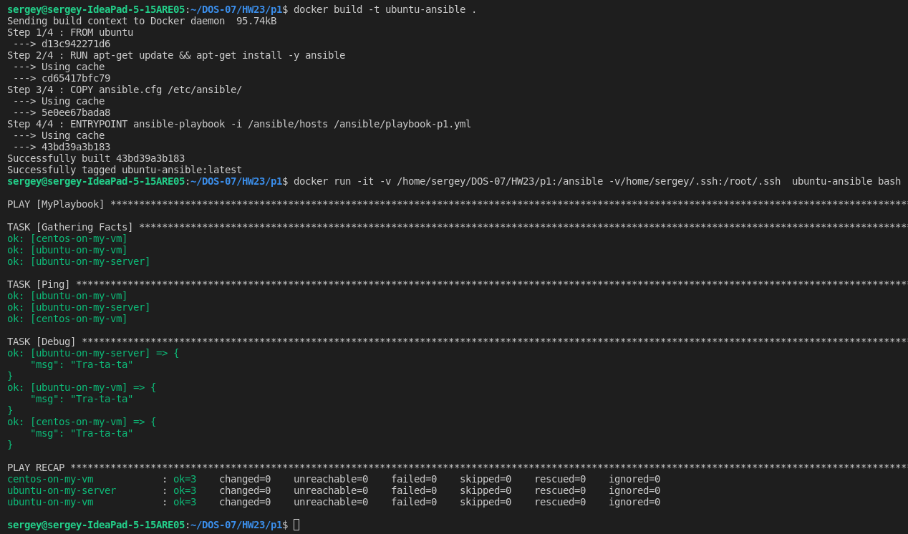
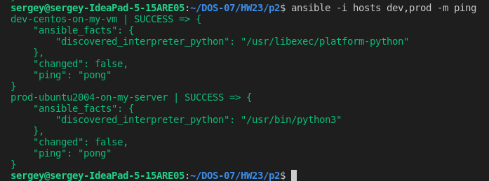
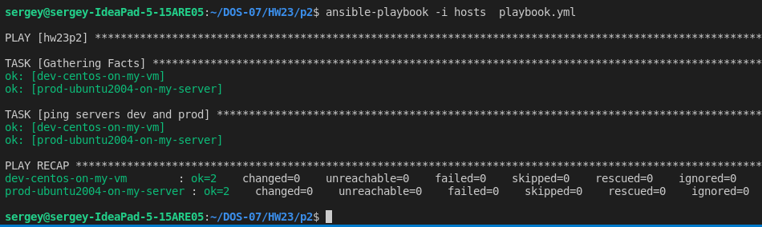
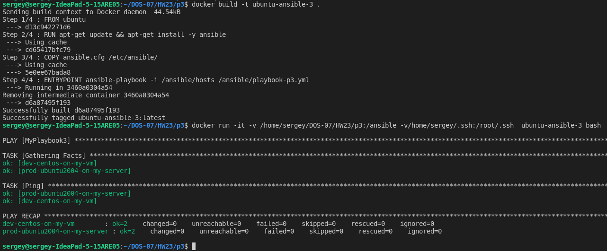
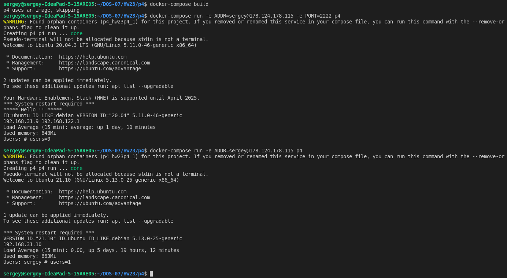
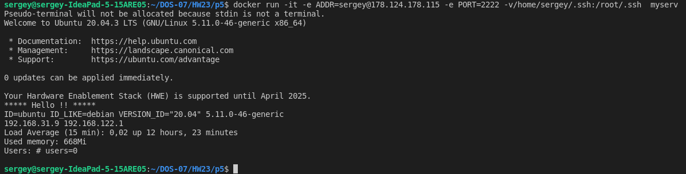

# HomeWork-23
Срок до 21.01.2021

##### 1. Развернуть систему управления конфигруацией ansible в докере и управлять нашими хостами
 - Написал (/p1/Dockerfile)
 - docker build -t ubuntu-ansible .
 - Написал /p1/hosts (в качестве inventory)
 - Написан /p1/playbook-p1.yml 
 - docker run -it -v /home/sergey/DOS-07/HW23/p1:/ansible -v/home/sergey/.ssh:/root/.ssh  ubuntu-ansible bash
 монтирую в контейнер директории с моим hosts,playbook и с ключами 

##### 2. Развернуть 4 виртуальные машины ubuntu и создать inventory file (db и app для дев и prod). 
##### Выполнить пинг через ansible для группы дев и прод.
 - Написал /p2/hosts (в качестве inventory)
 - ansible -i hosts dev,prod -m ping

то же самое через playbook 
 - написал /p2/playbook.yml
 - ansible-playbook -i hosts  playbook.yml

##### 3. Повторить пункт 2 только в докере.

- Написал (/p3/Dockerfile)
 - docker build -t ubuntu-ansible-3 .
 - Написал /p3/hosts (в качестве inventory)
 - Написал /p3/playbook-p3.yml
 - docker run -it -v /home/sergey/DOS-07/HW23/p3:/ansible -v/home/sergey/.ssh:/root/.ssh  ubuntu-ansible-3 bash
 монтирую в контейнер директории с моим hosts,playbook  и с ключами.
 

##### 4. Создать docker-compose file без хранения секретов, а передавать через параметры или файл
 
 Запускаю сервис из образа myserv из задания 5 через docker-compose с передачей туда значений через параметры при запуске и через файл:
 - создал /p4/docker-compose.yml
 - создал файл /p4/sec.env (в нем есть значени  PORT=2223)
 по адресу 178.124.178.115 у меня 2 машины на портах 2222 и 2223
 - docker-compose run -e ADDR=sergey@178.124.178.115 -e PORT=2222 p4
 получаю ответ от машины 2222 - значение из файла заменилось значением переданным через параметры
  - docker-compose run -e ADDR=sergey@178.124.178.115 p4   
 получаю ответ от машины на порту 2223 (из файла)
 
Через docker inspect никаких из данных (адресов и портов) не видно, значит "секреты" в образ и код не попали. 

##### 5. Докеризировать bash сервис
 Решил докеризировать bash-скрипт из HW16 (вывод данных о системе при подключении через SSH). 
 При запуске контейнера указывается адрес машины, порт, на той машине из-под контейнера запускается скрипт, выводит данные и выключается.
 - написан /p5/Dockerfile
 - в /p5/ перенесен скрипт HW16.sh
 - docker build -t myserv .
 - docker run -it -e ADDR=sergey@178.124.178.115 -e PORT=2222 -v /home/sergey/.ssh:/root/.ssh  myserv
 

