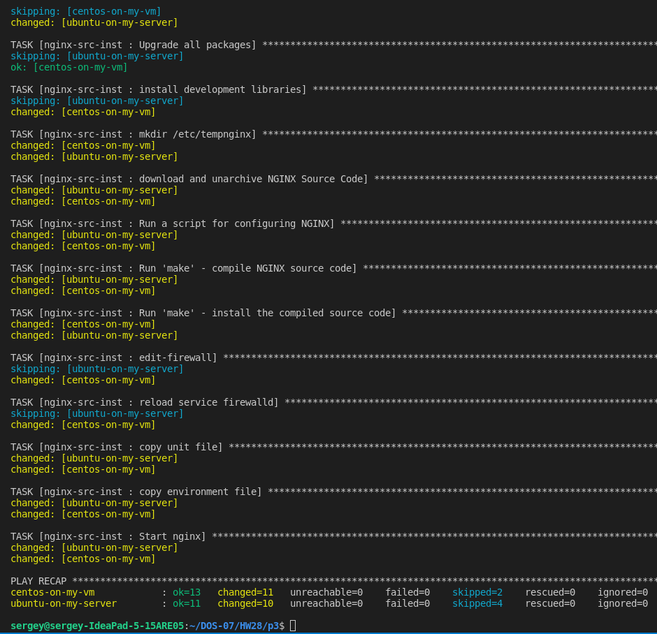
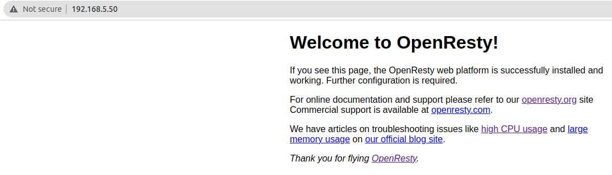
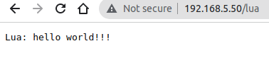
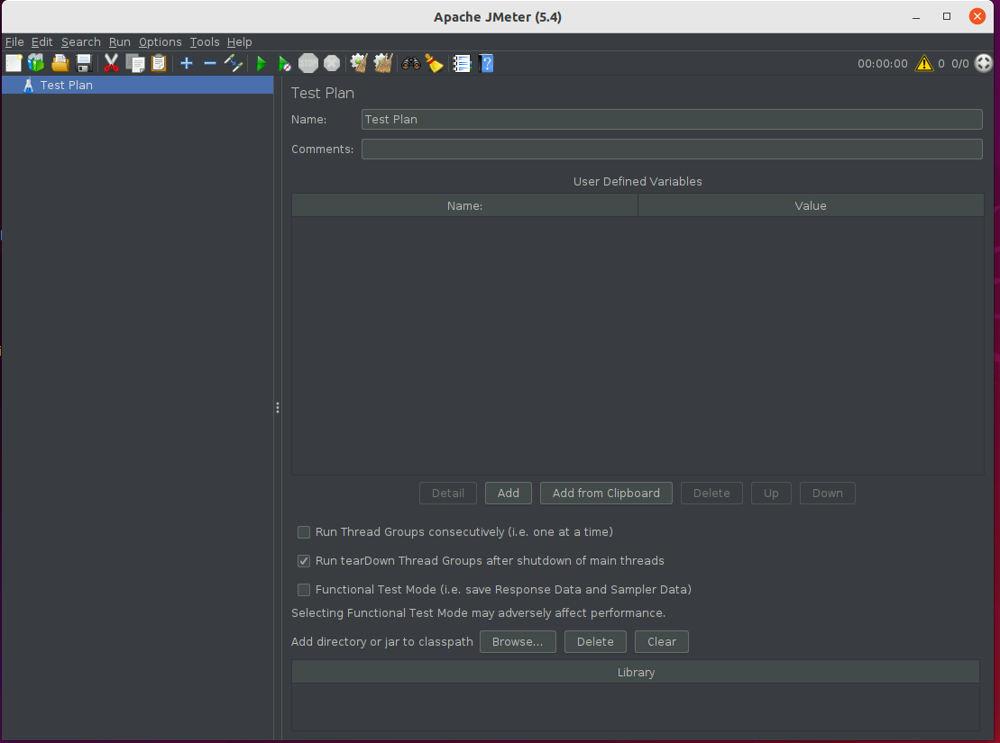

##### 1. Можно ли передать переменную окружения в ansible

Можно, если переменная окружения управляющей машины - через extra vars, если управляемой - через facts

##### 2. Привести пример модуля и плагина в ansible

- модуль - например, ping, apt, file ...
- плагин - lookup, vars, shell

##### 3. Развернуть nginx c lua модулем через ansible, либо установить nginx из source
#####    Проверить работоспособность

Устанавливаю Nginx-1.21.6 (p3) из исходников через Ansible (роль) на CentOS Stream release 8 и Ubuntu 20.04/21.04,
запускаю как сервис. Установка на машины без Nginx (не контролируется, не удаляется если есть).

Инструкции по установке из исходников (в "ручном режиме" без Ansible):
Ubuntu: https://www.alibabacloud.com/blog/how-to-build-nginx-from-source-on-ubuntu-20-04-lts_597793
Centos: https://tylersguides.com/guides/installing-nginx-from-source-on-centos-7/ (там есть про службу)

- сделал роль /p3/nginx-src-inst
- файлы для сервиса лежат в /nginx-src-inst/ (оттуда копируются на управляемую машину)
- запуск: ansible-playbook -i myhosts playbookHW28-3.yml
- nginx работает на всех машинах, отвечает в браузере

Установил Openresty (p3-2) через Ansible (роль) на CentOS Stream release 8 и Ubuntu 20.04,
Установка на машины без Nginx (не контролируется, не удаляется если есть).
Все по инструкциям из официального сайта openresty.

- сделал роль /p3-2/openresty-inst
- запуск: ansible-playbook -i myhosts  playbookHW28-3-2.yml
- для проверки в файл /usr/local/openresty/nginx/conf/nginx.conf в раздел server добавляю:

  location /lua {
             default_type 'text/plain';
             content_by_lua ' ngx.say("Lua: hello world!!!") ';
        }

- перезагружаю сервис: sudo systemctl reload openresty

##### 4. Установить  apache jmetr для тестирования нагрузки вебсерверов (лучше сделать через ansible и установить сервер, и воркеры на других машинах)
  - здесь лежит jmeter: https://downloads.apache.org/jmeter/binaries/
  - сделал роль /p4/apachejmeter (пока только ubuntu)
  - ansible-playbook -i myhosts playbookHW28-4.yml
  -  /etc/jmeter/apache-jmeter-5.4/bin/  ./jmeter.sh 

5. Доделать то, что не завершили на уроке

