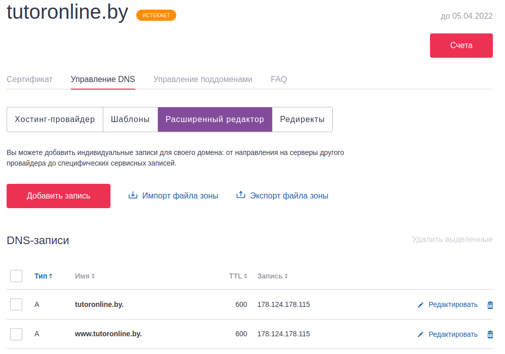
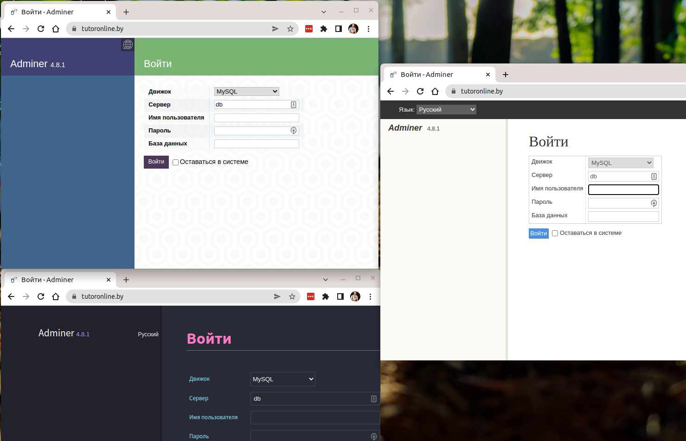

##### 1) Развернуть docker приложение в 3 экземплярах на сервере, которое слушается на 3 разных портах (используем ansible)
##### 2) Создать сертификат для nginx, используя let’s encrypt
##### 3) Развернуть  nginx  контейнер, который будет  балансировать траффик  на 3 экземпляра приложений, 
##### которые развернули выше + подкинуть сертификат (ansible используем)
 
  Делаю все 3 задания сразу:
  
  - Получаю сертификат используя let's encript (основная инструкция здесь: https://www.8host.com/blog/sozdanie-sertifikata-lets-encrypt-dlya-nginx-v-ubuntu-20-04/) :
     у меня есть домен tutoronline.by, на него и получаю сертификат
     - прописал DNS на мой адрес
    
      
    
     - sudo apt install certbot python3-certbot-nginx
     - настроил на машине (доступной по зарегистрированному адресу) nginx 
     - создал 2 конфиг файла
          /etc/nginx/conf.d/tutoronline_by.conf (для 80 порта)
          /etc/nginx/conf.d/tutoronline_by_ssl.conf (для 443 порта чтобы проверить как работает после получения сертификата)
     - перезагрузил nginx
     - получаю сертификат: 
       sudo certbot --nginx -d tutoronline.by -d www.tutoronline.by
     
 
  - Создал ansible - роль (docker-inst) для установки docker на удаленную машину
  - Создал ansible - роль (inst-adminer-mysql-balans) для развертывания 4-х контейнеров: 3 экземпляра с adminer на разных портах (88,89,90)
  и 1 конейнер nginx c балансировщиком и сертификатом. Чтобы увидеть, что балансировщик работает и обращение идет к разным 
  экземплярам adminer - у adminer  использован разный дизайн в каждом экземпляре.
  - в директорий inst-adminer-mysql-balans/files скопировал полученные ранее сертификаты и файл с конфигурацией для балансировщика (defaults.conf)
  - запуск - playbookHW29-1
  - на скриншоте - 3 экземпляра tutoronline.by - защищенное сертификатом соединение и 3 разных дизайна (балансировщик работает)
   
   

##### 4) Посмотре	else(есть?)

нет
##### 5) Установить дополнительный модуль для nginx и показать реализацию в nginx.conf

информация здесь: https://docs.nginx.com/nginx/admin-guide/dynamic-modules/dynamic-modules/

- создал файл /p5/index.html
- разместил его и изоражение (ulitka.png) в /var/www/tutoronline.by/public_html/ (на машине с nginx)
- картинка на страничке:
 
  

- добавил в config nginx (/etc/nginx/conf.d/tutoronline_by_ssl.conf):
     location /ulitka.png {
         image_filter rotate 180;
     }

- sudo systemctl restart nginx
- изображение перевернулось:

