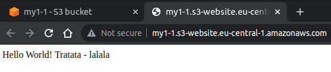
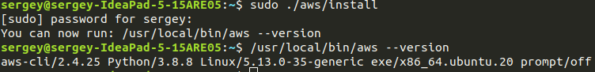

1) Создать iam юзера с пермишнами - создание инстансов(только тип t2.micro), security groups и s3 бакетов (создать свою полиси и приаттачить ее к юзеру)
##### 2) Развернуть инстанс открыв 22 и 80,443 порты наружу

3) Используя ансибл установить nginx и проверить доступность со своего компьютера

##### 4) Создать s3 бакет, разместить в него веб-сайт, проверить доступность со своего компьютера
- инструкция здесь: https://docs.aws.amazon.com/AmazonS3/latest/userguide/HostingWebsiteOnS3Setup.html

##### 5) Установить AWS SDK и через aws-cli повторить пункт 2 и 4, используя креды юзера, которого создали

- инфо по установке AWS SDK здесь: https://docs.aws.amazon.com/cli/latest/userguide/getting-started-install.html

- aws ec2 create-security-group --group-name MyGroup8022443 --description "Security group 80 22 443"
- aws ec2 authorize-security-group-ingress --group-name MyGroup8022443 --protocol tcp --port 80 --cidr 0.0.0.0/0
- aws ec2 authorize-security-group-ingress --group-name MyGroup8022443 --protocol tcp --port 22 --cidr 0.0.0.0/0
- aws ec2 authorize-security-group-ingress --group-name MyGroup8022443 --protocol tcp --port 443 --cidr 0.0.0.0/0
- aws ec2 run-instances --image-id ami-0d527b8c289b4af7f --count 1 --instance-type t2.micro --key-name MyAwsKeyPair --security-group-ids sg-09764380acf031f14
(здесь скриншот о доступности портов)

здесь надо п 4 из cli

- aws s3api create-bucket --bucket my1serwol-b --create-bucket-configuration LocationConstraint=eu-central-1 --region eu-central-1
- aws s3 website s3://my1serwol-b/ --index-document index.html --error-document error.html

6) Написать баш скрипт, который будет делать пункт 2 и 4

Много информации здесь: https://blog.eq8.eu/til/create-aws-s3-bucket-as-static-website-with-cli.html

