##### 1. Поднять инстанс в us-east-1, поставить туда nginx и создать ami
 - запущен инстанс в N.Virginia, запущен nginx

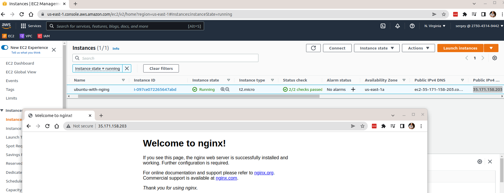

 - создан ami

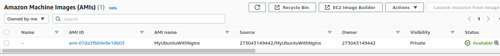

##### 2. Написать скрипт, который будет копировать эту ami в другой регион

   - скрипт copy-ami.sh в качестве параметров в скрипт регион откуда копировать и регион куда копировать

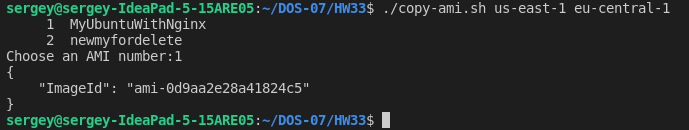

##### 3. Создать vpc, сделать 3 сабнеты (паблик, изолированную и бэкенд)

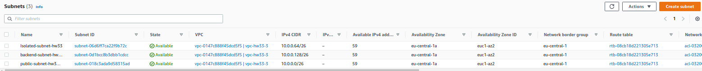

##### 4. Приаттачить internet gateway к этой vpc

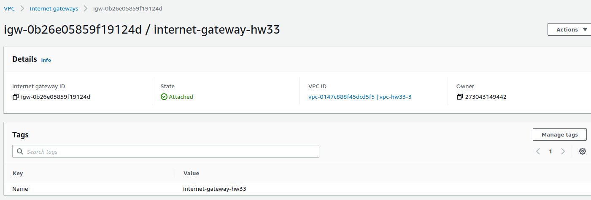

##### 5. Настроить маршрутизацию между этими сабнетами

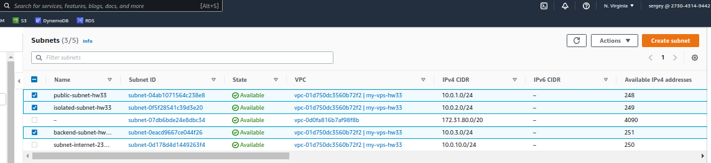

##### 6. Развернуть бастион в паблик сети и nginx в изолированной

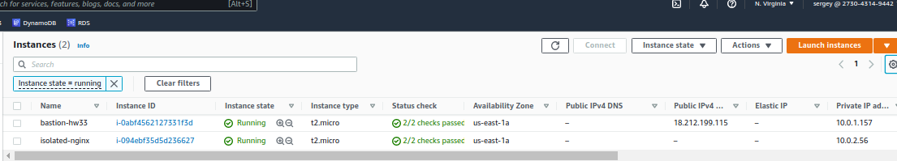

##### 7. Проверить доступ из бастиона к изолированной сети

##### 8. Поднять RDS с сервер с базой данных, настроить репликацию и бэкапы

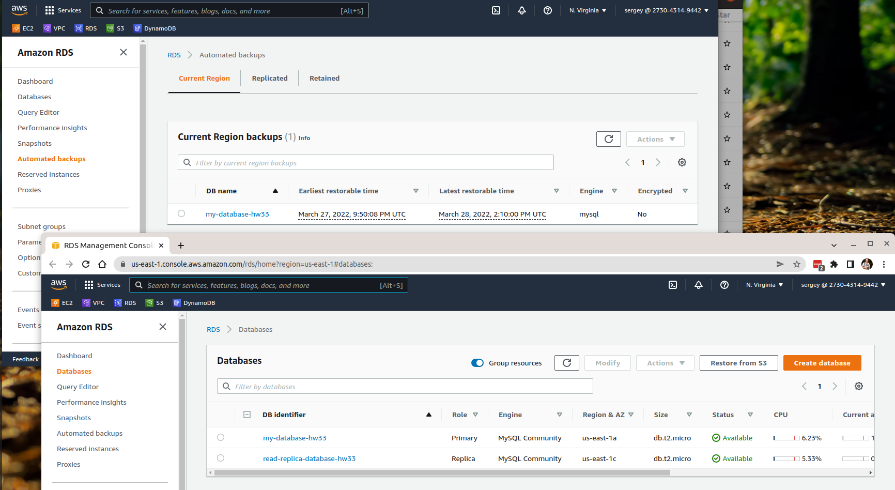

##### 9. Написать скрипт, который будет делать бэкап базы по расписанию и хранить на s3

информация здесь: https://docs.aws.amazon.com/AmazonRDS/latest/UserGuide/USER_ExportSnapshot.html

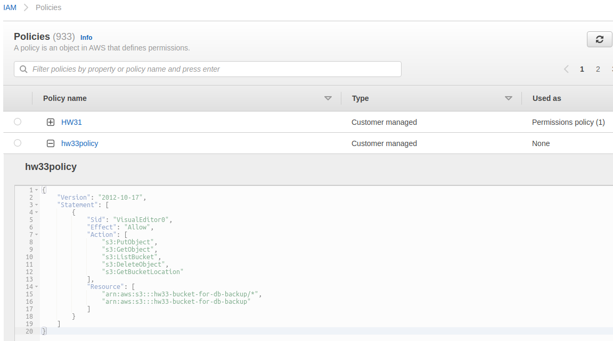

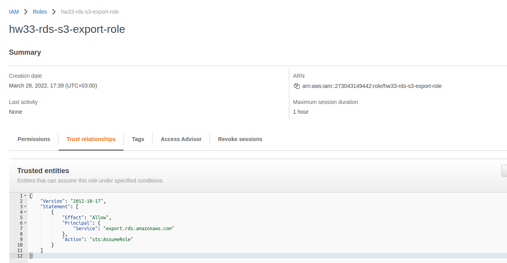

недоделано base-backup-s3.sh вылетает с ошибкой ругается на не совпадение региона

cd ------- 10. Посмотреть, как асьюмить роли. Создать роль и заасьюмить ее пользователем

##### 11. Настроить отображение вебконтента (Index.html) через cloudfront + s3
(путь /dos-07 в cloudfront, index.html не доступен из вне)

информация здесь: 
https://aws.amazon.com/ru/premiumsupport/knowledge-center/cloudfront-serve-static-website/

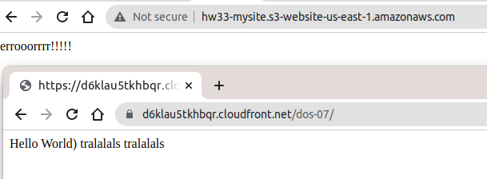

##### 12. Настроить отображение вебконтента (Index.html) через cloudfront + ALB + EC2

https://aws.amazon.com/ru/cloudfront/getting-started/EC2/

Результат работы (nginx на разных инстансах через балансировщик и cloudfront):

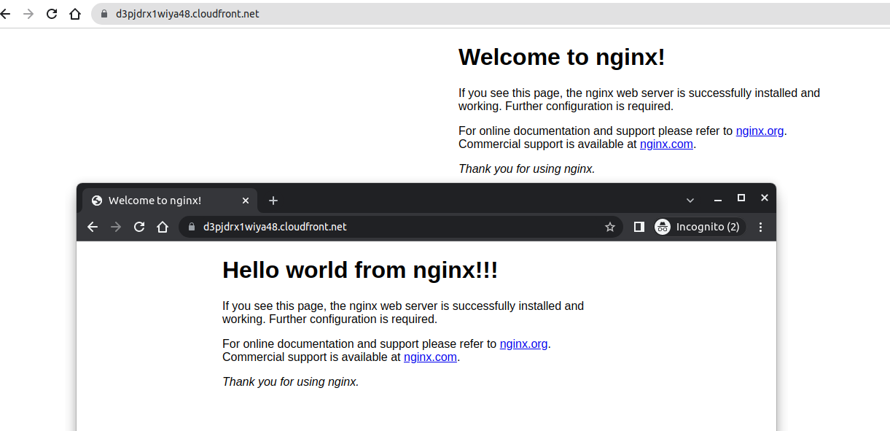

