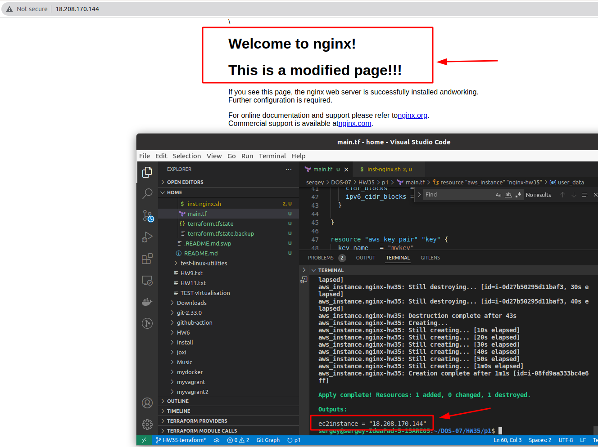
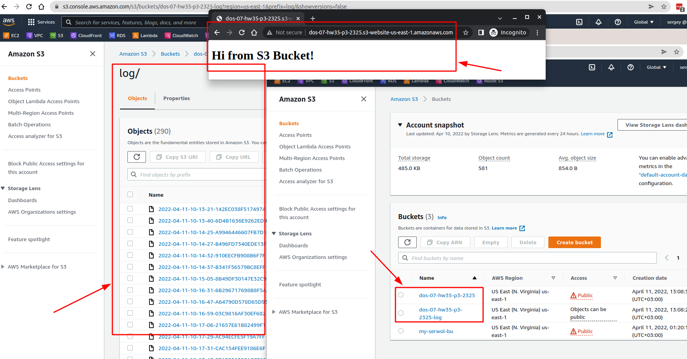

##### 1. Развернуть security group, ec2 и nginx, используя терраформ

  1.1 * - Кастомная nginx страница
  1.2 - Вывести через output публичный адрес(чтобы не заходить в авс)

- написал main.tf (директорий p1)
- написал скрипт inst-nginx.sh, подключил как userdata

результат: 

##### 2. Подключиться к странице с nginx с локальной машины

результат выше

##### 3. Создать s3 бакет, разместить в него веб-сайт, проверить доступность со своего компьютера, используя терраформ(посмотреть local-exec или просто curl локально)
   Для s3 бакета должно быть включено логгирование

- написал s3-site.tf (директорий p3)
- там же index.html который загружается на s3 bucket

Результат:

