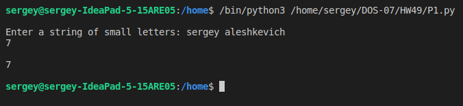
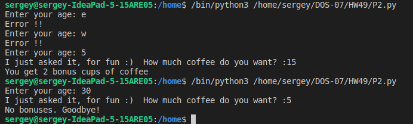
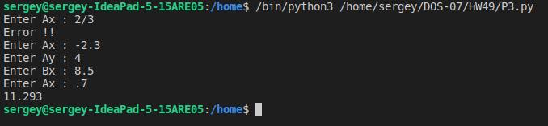
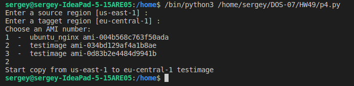
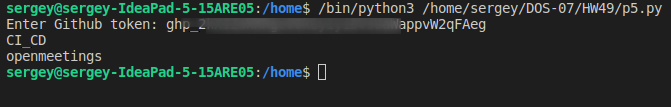

##### 1. Пользователь вводит строку из букв в нижнем регистре. Нужно посчитать, сколько в этой строке английских гласных букв. 
Корректность ввода не проверять. (2 варианта, в одном из вариантов не использовать вспомогательные функции)

- файл p1.py
 

##### 2. Клиент покупает кофе в кафе. За каждые 6 чашек, 1 чашка даётся в качестве бонуса.
Задача: запросить у пользователя кол-во чашек на покупку, вычислить полагающееся кол-во бонусных чашек кофе и вывести это число на консоль.
В функцию можно передать строку, которая будет выведена на экран для общения с пользователем, например:
age = input('Введите ваш возраст')л

- файл p2.py

##### 3. Запросить у пользователя координаты x и y двух точек на плоскости. Посчитать расстояние между заданными 
точками и вывести результат на консоль с точностью до трёх знаков после запятой (плавающей точки).
римечание: у каждой точки есть две координаты: x и y. Формулу в интернете можно посмотреть.

- файл p3.py

##### 4. Написать скрипт на пайтоне, который копирует AMI между регионами.

- файл p4.py
- для работы с AWS используется boto3
- есть значения по умолчанию для регионов и проверка правильности ввода регионов
- выводится список AMI в исходном регионе и предлагается выбор по порядковому номеру в списке и проверка на правильность ввода номера

##### 5. Есть проект на Github/Gitlab, в нем много репозиториев - нужно вывести список репозиториев, в которых есть файл properties внутри репы

- pip install PyGithub
- файл p5.py

