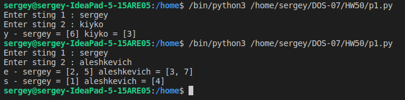
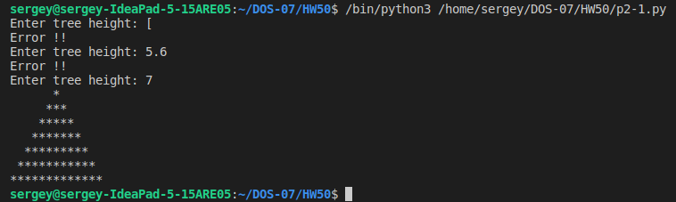
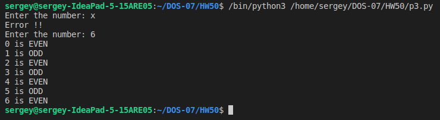
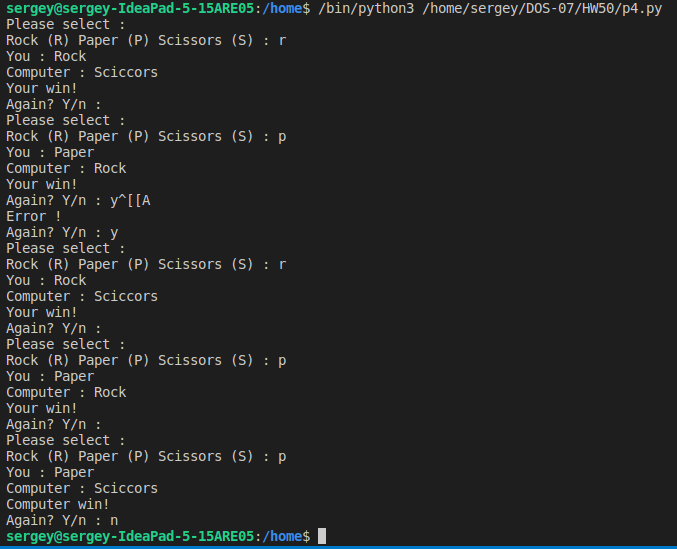
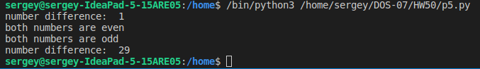
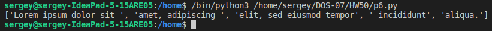

##### 1) Пользователь вводит две строки. Программа выводит совпадающие буквы двух строк и их позиции в каждой строке. Считать, что позиции начинаются с 1.
Пример: первая строка «sergey», вторая строка «kiyko»
Вывод программы:
y – первая строка = 6, вторая строка = 3
и тд

- файл p1.py

##### 2) Вывести лесенкой символ звёздочки по кол-ву строк, заданных пользователем:
запросить ввод у пользователя кол-ва строк, вывести звёздочки лесенкой.
- Например, пользователь ввёл число 2. Тогда выводим:
*
**
- Например, пользователь ввёл число 4. Тогда выводим:
*
**
***
****
и так далее, смысл должен быть ясен. 
Примечание: символ можно умножать на число, получая строку с дублированным символом 
(но решить можно и без этого)

- делаю усложненный вариант (где получается симметричная ёлка)
- файл p2.py

##### 3) Запросить у пользователя ввод числа. Построить цикл от 0 до введённого числа (включительно) и для чётных чисел вывести то, что они чётные, а для нечётных, что они нечётные. Пример вывода:
0 is EVEN
1 is ODD
2 is EVEN
и так далее…

- файл p3.py

##### 4) Написать игру в "камень-ножницы-бумага" против компьютера.
Запустить игру в бесконечном цикле. Запросить ввод от пользователя (R - камень, S - ножницы, P - бумага). 
Сгенерировать случайный выбор компьютера. Вывести выбор компьютера. 
Определить победителя, выведя соответствующую информацию. 
Спросить пользователя - хочет ли он повторить игру. 
Если хочет - повторить, не хочет - выйти из цикла.

- файл p4

##### 5) Написать и протестировать функцию.
Функция получает на вход два числа. Если оба числа чётные, функция возвращает сообщение - что они четные. Если оба числа нечётные, функция возвращает их сообщение, что они нечетные. 
Если одно число чётное, а второе нечётное – функция возвращает разницу двух чисел.

- файл p5

##### 6) Написать и протестировать функцию.
Функция разделяет строку на строки. Параметр разделитель \\.

- файл p6

